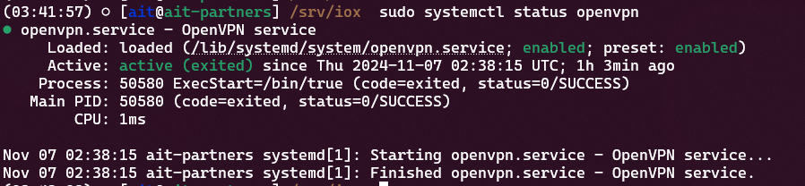
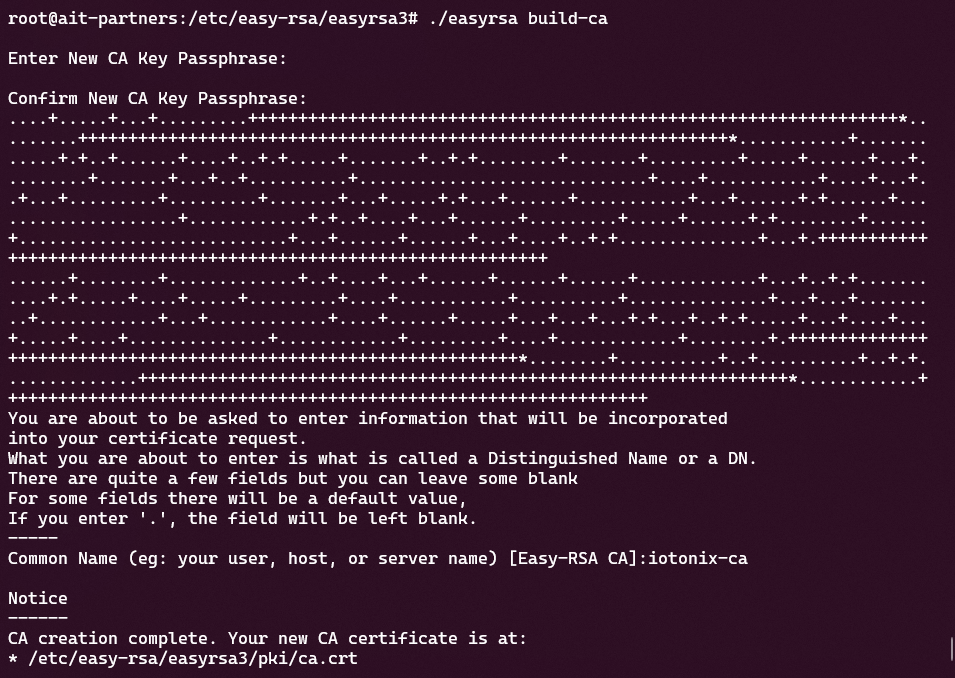

# OpenVPN Installation & Configuration Guide for Mobile Devices

## Server Installation Guide

<style>

</style>

<div class="container">
    <div class="sidebar">
        <h2>Table of Contents</h2>
        <ul>
            <li><a href="INSTALL,html">Server Installation Guide</a></li>
            <li><a href="CONFIG,html">Server Configuration Guide</a></li>
            <li><a href="CLIENT,html">Client Configuration Guide</a></li>
            <li><a href="OPERATIONS,html">Operations Guide</a></li>
            <li><a href="ADVANCED,html">Advanced Topics Guide</a></li>
            <li><a href="FAQ,html">Frequently Asked Questions</a></li>
        </ul>
    </div>
</div>

This guide provides step-by-step instructions for installing and configuring an OpenVPN server on Ubuntu 22.04 LTS.

## Prerequisites

- A server running Ubuntu 22.04 LTS with root or sudo access.
- A basic understanding of Linux command-line operations.
- A registered domain name or a static public IP address for your server. (Optional, but recommended for easier access)

## Important Note: Document Your Passphrases

**Note:** During the process of creating a Certificate Authority (CA), you will be prompted to enter a passphrase for the new CA key. **This passphrase is critical for securing your VPN** and will be needed whenever you generate or sign new certificates. Make sure to **write down this passphrase in a secure place**. Without it, you will not be able to proceed with further configuration or manage your CA.

## Step 1: Switch to Root User

1. To ensure you have all the necessary permissions throughout the installation, switch to the root user:

   ```bash
   sudo su -
   ```

## Step 2: Update System Packages

1. Update the package list and upgrade installed packages to their latest versions:

   ```bash
   apt update
   apt upgrade -y
   ```

## Step 3: Install OpenVPN

1. Install OpenVPN by running the following command:

   ```bash
   apt install -y openvpn
   ```

2. Check the status of the OpenVPN service to ensure it was installed properly:

   ```bash
   systemctl status openvpn
   ```

   You should see that the service is loaded and enabled, but if the status shows as **active (exited)**, it may need further configuration.

   

## Step 4: Install Easy-RSA

Easy-RSA is a utility for managing the Public Key Infrastructure (PKI) needed by OpenVPN. To install it, follow these steps:

1. Download Easy-RSA by cloning the Git repository, as it may not be available via apt on Ubuntu 22.04. You need root permissions to create the directory in `/etc`:

   ```bash
   apt install -y git
   git clone https://github.com/OpenVPN/easy-rsa.git /etc/easy-rsa
   ```

2. Navigate to the Easy-RSA version 3 directory (as Easy-RSA files are located under `easyrsa3`):

   ```bash
   cd /etc/easy-rsa/easyrsa3
   ```

3. Initialize the PKI environment:

   ```bash
   ./easyrsa init-pki
   ```

## Step 5: Build the Certificate Authority (CA)

Now that the PKI has been initialized, you can create your Certificate Authority (CA):

1. Create the Certificate Authority:

   ```bash
   ./easyrsa build-ca
   ```

   You will be prompted to enter a passphrase for the new CA key. **This passphrase is used to protect your CA's private key, which is crucial for securing your VPN**. Choose a strong passphrase and make sure to **document it securely**, as it will be needed whenever you generate or sign new certificates.

   You will also be prompted to enter a common name for the CA. You can use a name like "OpenVPN-CA" or any name that represents your use case.

   

## Step 6: Generate Server Certificate and Key

Once the CA is created, you need to generate a certificate and key for the VPN server.

1. Generate the server certificate and key:

   ```bash
   ./easyrsa gen-req server nopass
   ```

   This will generate a server request without a passphrase. The `nopass` option means the key won't be encrypted with a passphrase, which is convenient for automated server start-ups but comes with a reduced security level.

2. Sign the server certificate request using the CA:

   ```bash
   ./easyrsa sign-req server server
   ```

   You will be asked to confirm that you want to sign the certificate. Type `yes` to proceed.

   This step generates a signed server certificate that will be used by the OpenVPN server to authenticate itself to clients.

## Step 7: Generate Diffie-Hellman Parameters

Diffie-Hellman parameters are needed for the server to establish secure connections.

1. Generate the Diffie-Hellman parameters:

   ```bash
   ./easyrsa gen-dh
   ```

   This step may take some time depending on the server's processing power.

## Step 8: Restarting the Entire Easy-RSA Process

If you need to start over, for example, if you forgot the CA passphrase or made an error during the setup, you can completely reset the Easy-RSA PKI environment:

1. Navigate to the Easy-RSA directory:

   ```bash
   cd /etc/easy-rsa/easyrsa3
   ```

2. Remove the existing PKI directory to reset everything:

   ```bash
   rm -rf pki
   ```

3. Reinitialize the PKI environment:

   ```bash
   ./easyrsa init-pki
   ```

   This will allow you to restart the process from Step 5, where you can rebuild the CA with a new passphrase.

**Remember:** Always securely document your passphrase to avoid needing to restart the process.
